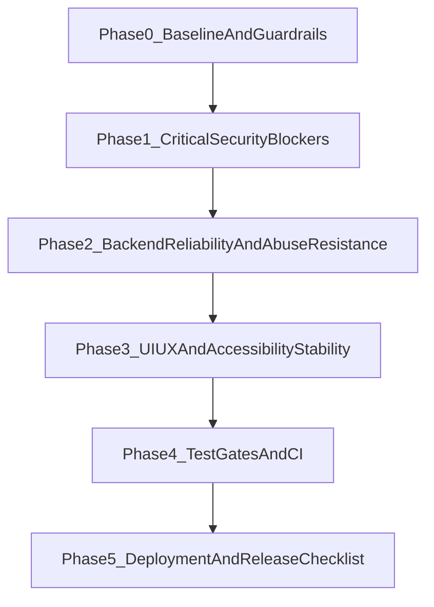

# Open Claude Cowork Final Production Plan

## Goal

Ship a production-ready release by addressing validated security, reliability, UX, and operational gaps first, while explicitly de-scoping unverified or low-impact items.

## Consolidated Findings Baseline

This plan merges and de-duplicates findings from:

- `[.cursor/plans/open_claude_cowork_analysis_plan_b31bae32.plan.md](.cursor/plans/open_claude_cowork_analysis_plan_b31bae32.plan.md)`
- `[.cursor/plans/open_claude_cowork_analysis_plan_f0221906.plan.md](.cursor/plans/open_claude_cowork_analysis_plan_f0221906.plan.md)`
- `[.cursor/plans/production_readiness_analysis_9ca0cb9a.plan.md](.cursor/plans/production_readiness_analysis_9ca0cb9a.plan.md)`
- `[.cursor/plans/production_readiness_audit_f5c0e6e8.plan.md](.cursor/plans/production_readiness_audit_f5c0e6e8.plan.md)`
- `[.cursor/plans/production-readiness-audit_fae89f10.plan.md](.cursor/plans/production-readiness-audit_fae89f10.plan.md)`

Validated correction:

- The prior claim that `CLAUDE.md` incorrectly states tests are configured is outdated;  `[CLAUDE.md](CLAUDE.md)`  currently matches reality (`npm test` runs Vitest).

## Prioritized Execution Flow

## Phase 0 — Baseline and Guardrails

- Reconcile the current dirty working tree before implementation begins (many modified files already touch target areas).
- Freeze acceptance criteria and release blockers up front so scope cannot drift.
- Define a single issue tracker format: severity, owner, effort, fix PR, validation evidence.

Key files to baseline:

- `[server/server.js](server/server.js)`
- `[renderer/renderer.js](renderer/renderer.js)`
- `[server/job-scheduler.js](server/job-scheduler.js)`
- `[server/supabase/chat-store.js](server/supabase/chat-store.js)`
- `[server/supabase/report-store.js](server/supabase/report-store.js)`

## Phase 1 — Critical Security Blockers (Must Fix Before Release)

1. **Fix privilege and ownership flaws**

- Add field allowlist in `updateProfile` to prevent mass-assignment in `[server/supabase/chat-store.js](server/supabase/chat-store.js)`.
- Scope report result updates by user (`.eq('user_id', userId)`) in `[server/supabase/report-store.js](server/supabase/report-store.js)`.

1. **Reduce exploitability of dynamic content and tokens**

- Remove global JWT storage on `window` in `[renderer/auth.js](renderer/auth.js)` and `[renderer/web-api.js](renderer/web-api.js)`; move token handling behind closure/private module state.
- Harden HTML safety in `[renderer/renderer.js](renderer/renderer.js)`: no raw-HTML fallback when DOMPurify is unavailable, escape untrusted values used in templates/classes.

1. **Harden server attack surface**

- Replace client-facing `err.message` leakage with generic 5xx responses in `[server/server.js](server/server.js)` (pattern appears many times).
- Add route-level rate limiting for high-risk endpoints (chat, upload, auth-sensitive routes) in `[server/server.js](server/server.js)`.
- Restrict scheduler webhook headers and preserve host allowlist controls in `[server/job-scheduler.js](server/job-scheduler.js)`.

1. **Browser/script trust protections**

- Add CSP to `[renderer/index.html](renderer/index.html)`.
- Pin CDN versions and add SRI/crossorigin attributes for external scripts in `[renderer/index.html](renderer/index.html)`.

1. **Secrets-at-rest minimum hardening**

- Apply restrictive file permissions for persisted settings (API keys) in `[server/server.js](server/server.js)`.

## Phase 2 — Backend Reliability and Abuse Resistance

1. **Lifecycle and resource control**

- Add `SIGTERM` graceful shutdown path (mirroring `SIGINT`) and ensure scheduler stop/drain in `[server/server.js](server/server.js)` and `[server/job-scheduler.js](server/job-scheduler.js)`.
- Bound/evict `composioSessions` cache (TTL/LRU) in `[server/server.js](server/server.js)`.
- Ensure webhook fetch bodies are consumed/cancelled in `[server/job-scheduler.js](server/job-scheduler.js)`.

1. **API behavior consistency**

- Add explicit `/api/*` JSON 404 handler in `[server/server.js](server/server.js)`.
- Add robust request validation (UUID/length/schema) on key params and bodies in `[server/server.js](server/server.js)` and store modules.

1. **Latency and fault tolerance**

- Remove synchronous request-path I/O for settings/plugin discovery; cache and refresh with TTL in `[server/server.js](server/server.js)` and `[server/plugins/plugin-manager.js](server/plugins/plugin-manager.js)`.
- Add retry/backoff for embedding calls in `[server/supabase/embeddings.js](server/supabase/embeddings.js)`.
- Evaluate auth validation strategy in `[server/supabase/auth-middleware.js](server/supabase/auth-middleware.js)` to reduce avoidable per-request network dependency while preserving security.

## Phase 3 — UI/UX and Accessibility Stability

1. **Consistency and reliability**

- Replace `alert()`-based error handling with consistent in-app error UI in `[renderer/renderer.js](renderer/renderer.js)`.
- Fix retry behavior in DB explorer load flow in `[renderer/db-explorer.js](renderer/db-explorer.js)`.
- Triage and close known flaky/partial smoke behaviors documented in `[tests/TEST_RESULTS.md](tests/TEST_RESULTS.md)`.

1. **Responsive and accessibility readiness**

- Add mobile behavior for left sidebar to match right-sidebar responsive model in `[renderer/style.css](renderer/style.css)`.
- Add labels/semantics for icon-only controls in `[renderer/index.html](renderer/index.html)` and related renderer-generated controls in `[renderer/renderer.js](renderer/renderer.js)`.

1. **Non-blocking polish (post-release candidate unless required)**

- Dark mode support in `[renderer/style.css](renderer/style.css)`.
- Additional explicit token-expiry UX handling in `[renderer/web-api.js](renderer/web-api.js)`.

## Phase 4 — Test Gates and CI (Release Enforcement)

1. **Lock critical regressions with tests**

- Add/extend unit and integration tests for security fixes in:
  - `[tests/unit/server/supabase/auth-middleware.test.js](tests/unit/server/supabase/auth-middleware.test.js)`
  - `[tests/unit/server/supabase/job-store.test.js](tests/unit/server/supabase/job-store.test.js)`
  - `[tests/unit/server/job-scheduler.test.js](tests/unit/server/job-scheduler.test.js)`
  - add/expand tests for `chat-store` and `report-store` auth scoping behavior
- Add renderer tests for token handling and sanitization behavior in `[tests/unit/renderer](tests/unit/renderer)`.

1. **Create minimum CI required checks**

- Add workflows under `[.github/workflows/](.github/workflows/)` for:
  - unit/integration (`npm test`)
  - smoke (`npm run test:smoke`)
  - optional coverage threshold gate

1. **Stabilize smoke suite signal quality**

- Reconcile genuine bugs vs timing/environment flakes in `[tests/smoke.spec.js](tests/smoke.spec.js)`, `[playwright.config.js](playwright.config.js)`, and `[tests/TEST_RESULTS.md](tests/TEST_RESULTS.md)`.

## Phase 5 — Deployment and Release Checklist

1. **Production-safe defaults and docs**

- Clarify environment requirements and mode-specific defaults in `[.env.example](.env.example)`, `[README.md](README.md)`, and `[SETUP_AND_DEPLOY.md](SETUP_AND_DEPLOY.md)`.
- Revisit `ALLOW_ANONYMOUS` production default and rollout guidance in `[.env.example](.env.example)` and `[Dockerfile](Dockerfile)`.

1. **Container/runtime hygiene**

- Add Docker `HEALTHCHECK` and confirm required runtime contract in `[Dockerfile](Dockerfile)`.
- Add artifact directories to `[.gitignore](.gitignore)`: `playwright-report/`, `test-results/`, `output/`.
- Replace `latest` dependency pins in `[package.json](package.json)` and `[server/package.json](server/package.json)` with controlled semver ranges.

1. **Optional packaging track (separate from blocker path)**

- Decide whether Electron installer/signing/auto-update is in this release scope; if yes, open separate execution stream and timeline.

## Release Gates (Go/No-Go)

Release is **No-Go** until all are true:

- Phase 1 items complete with tests.
- Phase 2 lifecycle/resource protections complete (shutdown, bounded caches, validation).
- CI workflows are active and passing on target branch.
- Smoke suite passes agreed baseline across primary browser targets.
- Production env/deploy checklist is documented and verified.

Release can be **Go with Known Risks** only if:

- Phase 3 polish items marked non-blocking are explicitly deferred with owners and dates.

## Explicitly De-scoped / Corrected Items

- Do not spend time on the old “tests are not configured” doc mismatch; this is already corrected in `[CLAUDE.md](CLAUDE.md)`.
- Keep architecture refactors (splitting very large `renderer/server` files) as structured follow-up unless a blocker fix requires local extraction for safety.

