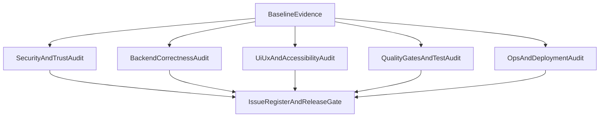

# Production Readiness Audit Plan

## Objective

Build a complete, evidence-based readiness assessment for the entire repository and produce a prioritized issue backlog (critical/high/medium/low) with clear release gates for production.

## Scope

- Desktop app runtime and IPC boundary: [main.js](main.js), [preload.js](preload.js), [renderer/renderer.js](renderer/renderer.js), [renderer/index.html](renderer/index.html)
- Backend/API and data flows: [server/server.js](server/server.js), [server/supabase/](server/supabase/), [server/job-scheduler.js](server/job-scheduler.js), [server/providers/](server/providers/)
- Plugin/browser/tooling trust surface: [server/plugins/plugin-manager.js](server/plugins/plugin-manager.js), [server/browser/](server/browser/), [clawd/](clawd/)
- Test and quality system: [tests/](tests/), [playwright.config.js](playwright.config.js), [vitest.config.js](vitest.config.js), [package.json](package.json), [server/package.json](server/package.json)
- Deployment/config/docs readiness: [.env.example](.env.example), [SETUP_AND_DEPLOY.md](SETUP_AND_DEPLOY.md), [README.md](README.md), [PUNCH_LIST.md](PUNCH_LIST.md)

## Audit Flow

## Workstreams

### 1) Baseline and inventory

- Confirm architecture/components and runtime modes using repository map and docs.
- Create an evidence index (file + command output + repro notes) for every issue found.
- Capture current quality baseline from existing test artifacts (including known partial/failing cases in [tests/TEST_RESULTS.md](tests/TEST_RESULTS.md)).

### 2) Security and trust-boundary audit

- Validate auth/session handling and anonymous behavior defaults from [server/supabase/auth-middleware.js](server/supabase/auth-middleware.js) and [.env.example](.env.example).
- Review CORS/null-origin behavior and protected route coverage in [server/server.js](server/server.js).
- Review plugin installation/execution controls and admin gating in [server/plugins/plugin-manager.js](server/plugins/plugin-manager.js).
- Review scheduler/webhook egress validation and SSRF protections in [server/job-scheduler.js](server/job-scheduler.js).
- Verify Electron preload/API boundary assumptions in [preload.js](preload.js).

### 3) Backend correctness and reliability audit

- Trace critical flows end-to-end: chat, tasks, jobs, reports, vault, uploads, settings.
- Check ownership checks, error handling, retries, and failure modes in [server/server.js](server/server.js) and `server/supabase/*-store.js` files.
- Validate scheduler behavior under edge cases (duplicate execution, lease expiry, malformed cron/config payloads).
- Assess dependency/runtime risk from unpinned `latest` dependencies in [package.json](package.json) and [server/package.json](server/package.json).

### 4) UI/UX + accessibility + incomplete-feature audit

- Run and triage smoke tests across browsers/devices from [tests/smoke.spec.js](tests/smoke.spec.js).
- Manually verify known weak spots from [tests/TEST_RESULTS.md](tests/TEST_RESULTS.md): sidebar timing, vault behavior, thinking-toggle state, file-attachment behavior, mobile overflow.
- Check consistency of feature coverage between UI and backend capabilities (jobs, reports, vault, settings, providers).
- Identify UX polish gaps and accessibility gaps (focus visibility, landmarks, keyboard flows) with reproducible defects.

### 5) Quality gates and automation-readiness audit

- Validate that current tests cover true critical flows and classify test debt vs product bugs.
- Audit missing gates: CI workflow files, linting, formatting, type-check/static validation, dependency/security scanning.
- Propose a minimum mandatory gate set for production branch protection (PR checks + nightly checks).

### 6) Ops/deployment readiness audit

- Validate runtime configuration safety and required production env contract from [.env.example](.env.example).
- Reconcile deployment docs with current implementation and unresolved deployment TODOs in [SETUP_AND_DEPLOY.md](SETUP_AND_DEPLOY.md).
- Verify container/web deployment assumptions and fallback behavior for Electron-vs-web modes.
- Produce a production checklist (secrets, CORS policy, auth mode, allowlists, monitoring/alerts, rollback plan).

### 7) Synthesis and release decision package

- Produce a single issue register with: severity, impact, evidence, repro steps, root-cause hypothesis, recommended fix, owner, effort, and blocker status.
- Define hard release blockers (must-fix) vs post-release backlog.
- Provide go/no-go recommendation with explicit confidence level and residual risk list.

## Known high-priority starting hypotheses (to validate early)

- No in-repo CI workflow and missing lint/typecheck gates.
- Production-risk defaults/config drift around anonymous mode and allowlists.
- Documented UI/test instability in mobile/responsive and some interactive states.
- Deployment readiness is partially documented but still has unresolved checklist items.

## Deliverables

- `production-readiness-audit.md` (full findings, grouped by area)
- `production-readiness-issues.json` (structured issue list for tracking)
- `release-gate-checklist.md` (pass/fail gate list)
- Prioritized remediation sequence (critical path first)

## Exit criteria

- Every critical user flow has either passing evidence or a logged blocker.
- Every high/critical security or correctness risk has an owner and fix plan.
- Minimum quality gates for production are defined and implementable.
- Clear go/no-go recommendation is documented with residual risks.

