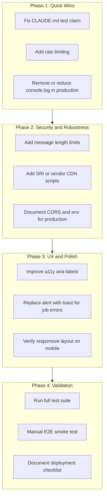

# Production Readiness Analysis Plan

## Project Context

**Open Claude Cowork** is an Electron desktop chat app with:

- **Renderer**: Vanilla HTML/JS/CSS frontend (no framework)
- **Server**: Node.js + Express (ESM)
- **Backend**: Claude Agent SDK, Composio, optional Supabase/Opencode
- **Clawd**: Separate messaging bot (WhatsApp, Telegram, Signal, iMessage)

---

## 1. Code Correctness and Inconsistencies

### Documentation vs Reality

- **[CLAUDE.md](CLAUDE.md)** line 55 says "There are no tests configured (`npm test` is a no-op placeholder)" — **false**: Vitest is configured with 26 test files in `tests/unit/` and `tests/integration/`. Update CLAUDE.md.

### Server Package Dependencies

- `express-rate-limit` appears in [server/package-lock.json](server/package-lock.json) as transitive dependency but is **not** imported or used in [server/server.js](server/server.js). Either add rate limiting or remove the dependency.

### Debug Logging in Production

- Many `console.log` / `console.debug` calls in [renderer/renderer.js](renderer/renderer.js), [preload.js](preload.js), [server/server.js](server/server.js), providers, and clawd. Consider:
  - Wrapping in `NODE_ENV !== 'production'` checks
  - Or using a proper logger (e.g. `debug` npm package, already in deps)

---

## 2. Security

### Rate Limiting

- No rate limiting on `/api/chat`, `/api/upload`, or auth endpoints. Add `express-rate-limit` (already available transitively) to prevent abuse and DoS.

### CORS

- [server/server.js](server/server.js): `DEFAULT_CORS_ORIGINS` allows `localhost:3000` and `3001`. For web deployment (Coolify), verify `CORS_ORIGINS` env covers production domain.

### Input Validation

- Chat `message` is sent as-is; server does minimal validation. Consider:
  - Max length (e.g. 100k chars) to prevent memory exhaustion
  - Zod validation on critical endpoints (server already has `zod`)

### API Key Storage

- User settings stored in [server/user-settings.json](server/server.js) (relative to server dir). For Docker, this is ephemeral unless mounted. Document volume persistence for production.

### XSS

- [renderer/renderer.js](renderer/renderer.js) uses `DOMPurify.sanitize()` for markdown output — good.
- `contenteditable` doc editor ([index.html](renderer/index.html) line 476): ensure pasted/inserted content is sanitized when persisted or re-rendered.

---

## 3. UI Issues

### Accessibility (a11y)

- Only 2 `aria-*` / `role` usages found: `role="alert"` on backend banner, `aria-label` on one remove button.
- Most buttons (e.g. New Chat, Settings, Reports) lack `aria-label`; icons-only buttons need labels for screen readers.
- Form fields may need `aria-describedby` for error messages.

### SVG Attributes

- `stroke-width` used in SVG elements (e.g. [index.html](renderer/index.html) line 25). In SVG, the correct attribute is `stroke-width` (valid). For consistency, some codebases use `strokeWidth` in JSX; here it's HTML — no change needed.

### Error UX

- Chat errors shown inline with red text (`paragraph.style.color = '#c0392b'`) — acceptable but could use a consistent error component/toast.
- [renderer/renderer.js](renderer/renderer.js): `saveJob` uses `alert()` for errors; inconsistent with inline error patterns elsewhere.

### Responsive Design

- CSS has `@media (max-width: 768px)` and `480px` breakpoints. Desktop-first; verify mobile flows (sidebar collapse, chat input, modals).

---

## 4. Incomplete or Missing Features

### SETUP_AND_DEPLOY.md Checklist

- [SETUP_AND_DEPLOY.md](SETUP_AND_DEPLOY.md) lines 129–133 list open items:
  - Create Coolify project, deploy, confirm web UI + chat work
  - Sync from upstream
  - Optional custom domain, Opencode provider

### Supabase Optional Flows

- When Supabase is not configured: app works with `localStorage` fallback. Document behavior clearly (e.g. no sync, no vault when Supabase missing).
- Dockerfile sets empty `SUPABASE_*`; if auth is required for some flows, document env requirements.

### ALLOW_ANONYMOUS

- [.env.example](.env.example) and [Dockerfile](Dockerfile): `ALLOW_ANONYMOUS=true` — "Set to false once migration from localStorage is confirmed." This is a production config decision; document migration steps.

### Clawd Known Issues

- [clawd/README.md](clawd/README.md): "Create a GitHub issue for the login bug" — external bug; track separately.

---

## 5. Server and API

### Error Handling

- Some endpoints return generic `500` with `err.message`; avoid leaking stack traces or internal paths in production.
- Ensure unhandled rejections are caught (e.g. global handler).

### Health Check

- `GET /api/health` exists; verify it checks dependencies (e.g. Composio reachability) if desired for k8s/Docker health probes.

### File Upload

- Multer limits 50MB ([server/server.js](server/server.js) line 573). Document and consider configurable limit.

---

## 6. Frontend and Electron

### Hardcoded URLs

- [preload.js](preload.js) line 3: `SERVER_URL = 'http://localhost:3001'` — correct for Electron. [web-api.js](renderer/web-api.js) uses relative URLs when same-origin; fallback `localhost:3001` for `file://` — good for web deployment.

### CDN Scripts

- [index.html](renderer/index.html): marked, Chart.js, DOMPurify, Supabase loaded from jsDelivr. For production:
  - Consider SRI (integrity) hashes for supply-chain security
  - Or bundle/vendor to avoid CDN dependency

### Electron Security

- [main.js](main.js): `nodeIntegration: false`, `contextIsolation: true`, `webSecurity: true` — good. DevTools commented out for production — good.

---

## 7. Testing

### Test Coverage

- Vitest covers unit (server, renderer, electron) and integration (API). Run `npm run test` and `npm run test:coverage` to verify all pass and identify gaps.
- No E2E tests (excluded in [vitest.config.js](vitest.config.js)); consider Playwright for critical flows (login, send message, settings).

### Renderer Tests

- Renderer tests use happy-dom; verify they cover SSE parsing, auth, and error paths.

---

## 8. Data and Persistence

### Migrations

- [server/supabase/migrations/](server/supabase/) — verify migrations run in order and are documented for fresh Supabase setup.
- Document how to run migrations (e.g. Supabase CLI or manual SQL).

### Vault

- Vault requires Supabase Storage. When Supabase is disabled, UI shows "Vault unavailable" — verify UX is clear.

---

## 9. Deployment

### Dockerfile

- [Dockerfile](Dockerfile): Runs only server (no Electron). Serves renderer as static files — correct for web deployment.
- Env defaults: `SUPABASE_*` empty, `ALLOW_ANONYMOUS=true`. Document required vs optional vars.

### Environment Variables

- [.env.example](.env.example) lists all options. Create a "Production Checklist" section with required vars for each deployment mode (Electron local, Docker web, Coolify).

---

## Suggested Execution Order

---

## Files to Prioritize

| Area     | Key Files                                                                                                                          |
| -------- | ---------------------------------------------------------------------------------------------------------------------------------- |
| Security | [server/server.js](server/server.js), [server/supabase/auth-middleware.js](server/supabase/auth-middleware.js)                     |
| UI/A11y  | [renderer/index.html](renderer/index.html), [renderer/renderer.js](renderer/renderer.js), [renderer/style.css](renderer/style.css) |
| Docs     | [CLAUDE.md](CLAUDE.md), [SETUP_AND_DEPLOY.md](SETUP_AND_DEPLOY.md), [README.md](README.md)                                         |
| Config   | [.env.example](.env.example), [Dockerfile](Dockerfile), [preload.js](preload.js)                                                   |

